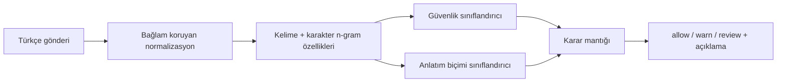

# Yapay Zekâ Mimarisi

## Prototipte gerçekten çalışan model
`ContextualDemoModerationEngine`, küçük sentetik Türkçe veri üzerinde kelime ve karakter n-gram TF-IDF + Logistic Regression kullanır. Güvenlik sınıfı ve anlatım biçimi ayrı modellerle tahmin edilir.

Bu seçim, teknik rapor teslimine yetişen sürümde internet/model indirme bağımlılığını kaldırırken gerçek, ölçülebilir ve yeniden üretilebilir ML yürütümü sağlar.

## Üretim yolu
Aynı servis arabirimi gelecekte BERTurk veya doğrulanmış başka bir Türkçe Transformer ile değiştirilebilir. Prototip bunu mevcutmuş gibi göstermemektedir.

