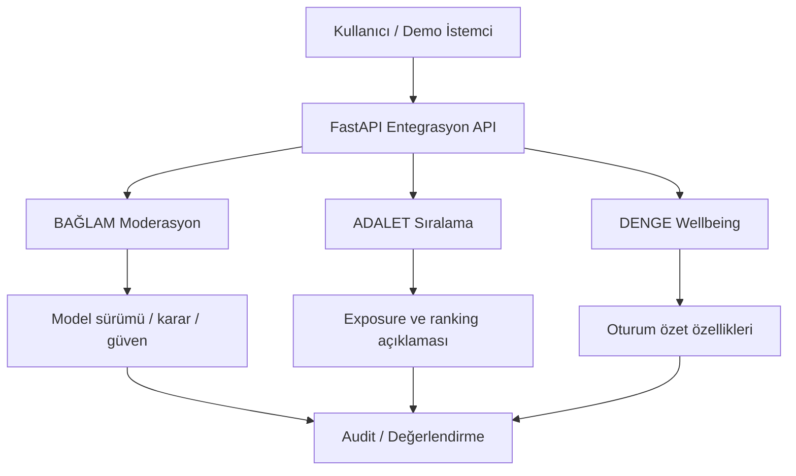

# Sistem Mimarisi

## Tek cümle
NSosyal Bağlam, sosyal medya platformunun yerine geçmek yerine API üzerinden eklenebilen üç karar servisi sunar.

## Katmanlar
1. **İstemci:** FastAPI ile aynı origin üzerinden servis edilen bağımlılıksız HTML/CSS/JavaScript sosyal medya istemcisi (`backend/static`).
2. **API:** FastAPI entegrasyon katmanı.
3. **Karar servisleri:** BAĞLAM, ADALET, DENGE.
4. **Değerlendirme:** sentetik/deterministik test verisi ve gerçek yerel çalıştırma metrikleri.

## Gerçek zaman / batch
- Moderasyon: yayın öncesi senkron.
- Ranking: istek anında sıralama; üretici exposure istatistikleri üretimde periyodik güncellenebilir.
- Wellbeing: oturum sırasında near-real-time.
- Analitik: batch/periyodik.
